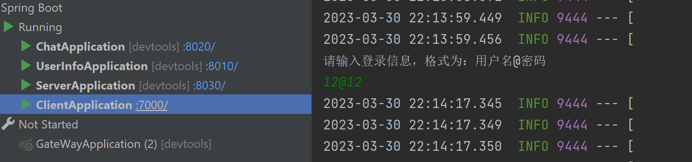
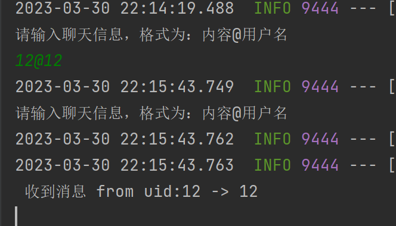

## demo简介
### 上游项目
[KT-Chat](https://github1s.com/KimTou/KT-Chat)(数据库业务)、
[Jcasbin-Demo](https://github.com/VINO42/jcasbin-springboot-demo)(netty实现分布式架构)、

该项目主要基于上游项目进行整合，了解cloud开发流程，以及netty的分布式架构思想。实现登录测试，私聊测试

#### 私聊
